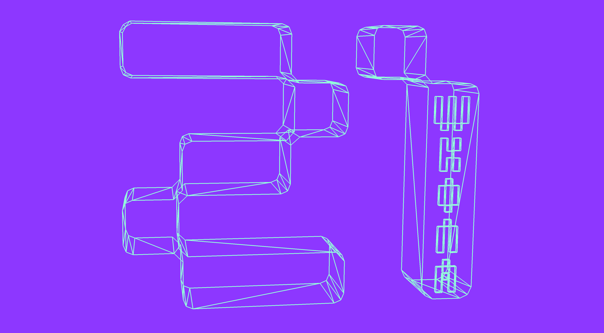

# Проект 3DViewer v2.0

Реализация на языке программирования С++ в парадигме объектно-ориентированного программирования приложения для просмотра 3D моделей в каркасном виде, реализующее функции вращения, передвижения, приближения.

## Part 1. 3DViewer v2.0

Разработка программы для визуализации каркасной модели в трехмерном пространстве.

- В один момент времени на экране отображается только одна модель
- Программа предоставляет возможности:
    - Загружать каркасную модель из файла формата obj (поддержка только списка вершин и поверхностей).
    - Перемещать модель на заданное расстояние относительно осей X, Y, Z.
    - Поворачивать модель на заданный угол относительно своих осей X, Y, Z.
    - Масштабировать модель на заданное значение.
- Графический пользовательский интерфейс реализован на базе QT Creator для C++  
- Графический пользовательский интерфейс содержит:
    - Кнопку для выбора файла с моделью и поле для вывода его названия.
    - Зону визуализации каркасной модели.
    - Кнопку/кнопки и поля ввода для перемещения модели. 
    - Кнопку/кнопки и поля ввода для поворота модели. 
    - Кнопку/кнопки и поля ввода для масштабирования модели.  
    - Информацию о загруженной модели - название файла, кол-во вершин и ребер.
- Программа корректно обрабатывает и позволяет пользователю просматривать модели с деталями до 1 000 000 вершин без зависания (зависание - это бездействие интерфейса более 0,5 секунды).

## Part 2. Настройки

- Программа позволяет настраивать тип проекции (параллельная и центральная)
- Программа позволяет настраивать тип (сплошная, пунктирная), цвет и толщину ребер, способ отображения (отсутствует, круг, квадрат), цвет и размер вершин
- Программа позволяет выбирать цвет фона
- Настройки сохраняются между перезапусками программы

## Part 3. Запись
 
- Программа позволяет сохранять полученные ("отрендеренные") изображения в файл в форматах bmp и jpeg
- Программа позволяет сохранять движения 3D-модели в gif-анимацию
